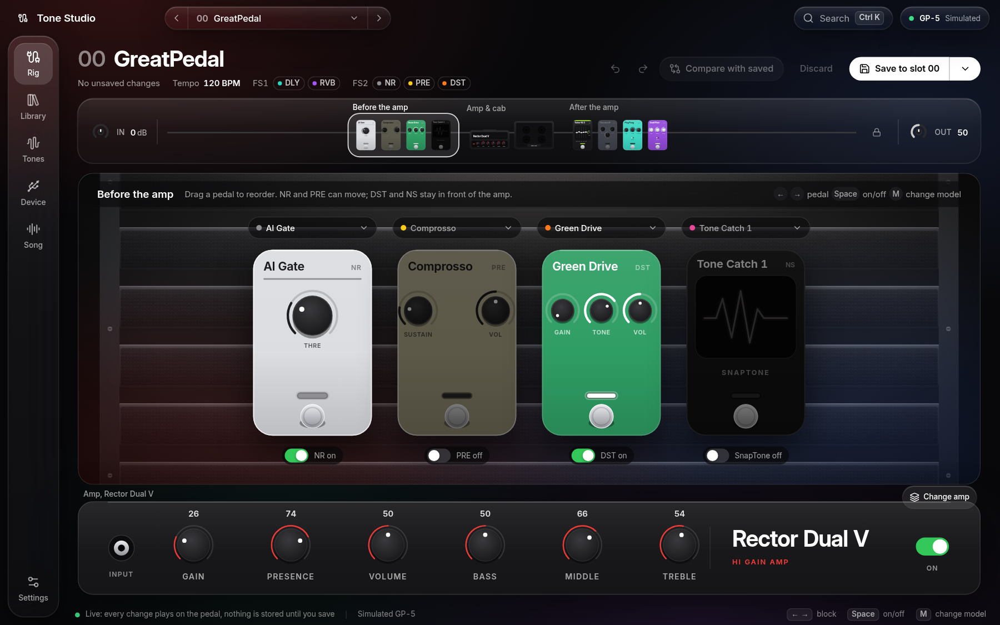
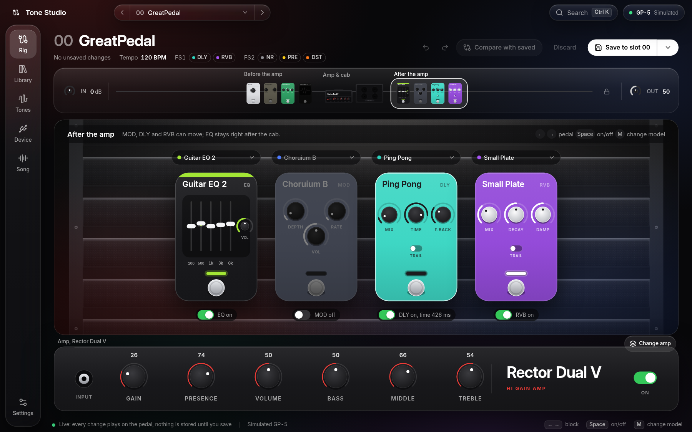
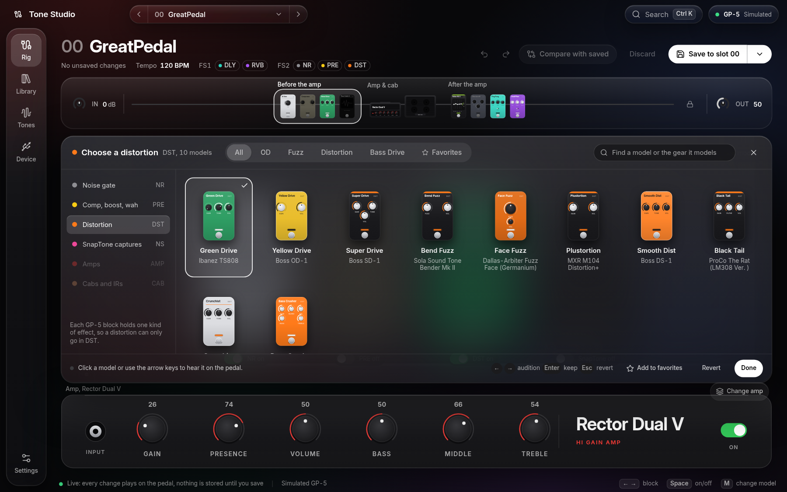
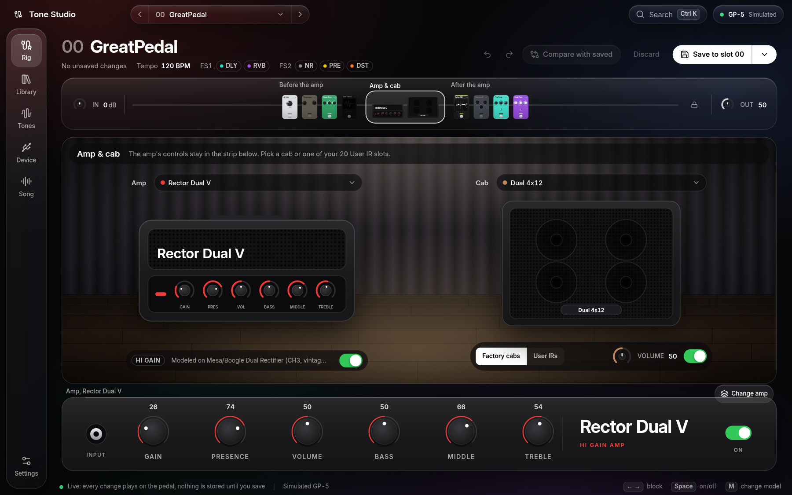
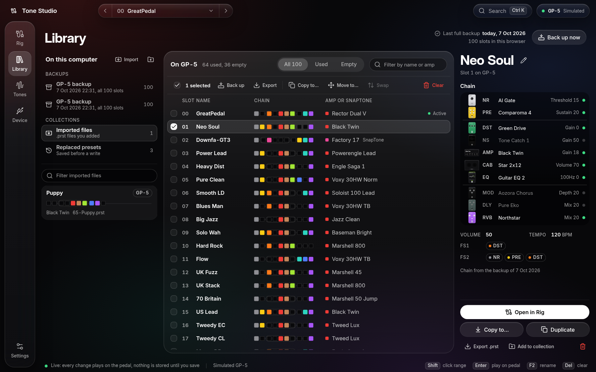
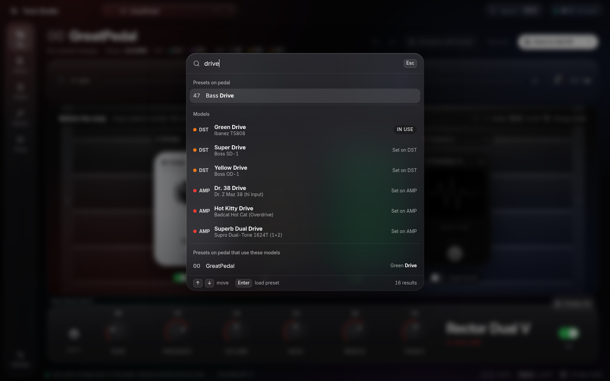
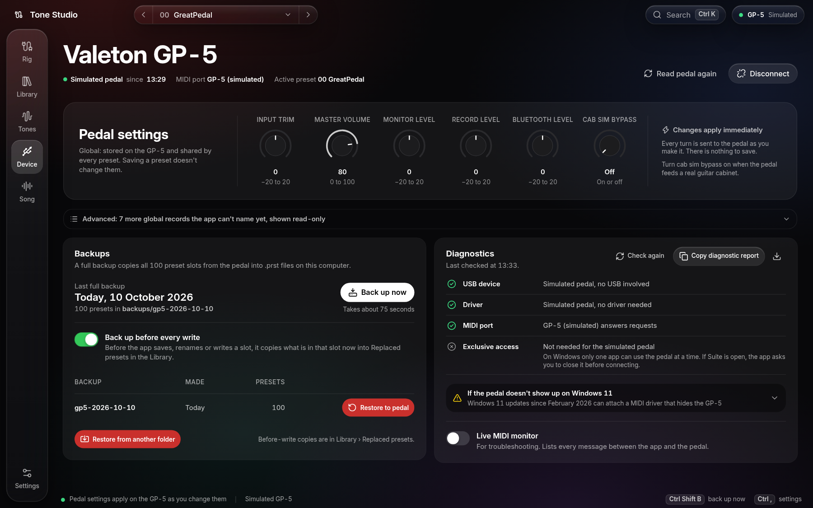

<div align="center">

<br>

# GP-5 Tone Studio

A desktop editor and librarian for the Valeton GP-5.<br>
Shape tones live, sort and back up all 100 slots, and bring in NAM captures from TONE3000.

<br>



<br>
<br>

**macOS** &nbsp;·&nbsp; **Windows** &nbsp;·&nbsp; **Linux** &nbsp;·&nbsp; **Chrome & Edge**

<br>

</div>

---

<div align="center">

<br>

## Every knob. Live.

Turn a knob on screen and you hear it on the pedal right away.<br>
Nothing is saved until you say so. Compare with the saved preset, undo, and drag pedals into a new order.

<br>



<br>
<br>

</div>

---

<div align="center">

<br>

## Hear it before you pick it.

Every model is listed with the real gear it's based on.<br>
Use the arrow keys to move through them and hear each one on the pedal. Press Enter to keep one, or Esc to go back.

<br>



<br>
<br>

</div>

---

<div align="center">

<br>

## The amp, then the cab.

Pick an amp and a cabinet, or load one of your 20 User IR slots.<br>
The amp's controls stay in the strip at the bottom of the screen.

<br>



<br>
<br>

</div>

---

<div align="center">

<br>

## A hundred presets. All in one view.

See the whole signal chain of every slot as a row of colours.<br>
Select several slots, then copy, move, swap or export them at once. Import `.prst` files, open backups, and get back any preset that was overwritten.

<br>



<br>
<br>

</div>

---

<div align="center">

<br>

## Just type.

Press <kbd>Ctrl</kbd> <kbd>K</kbd> and start typing.<br>
Search presets, models, and every preset that uses a model, all from one box.

<br>



<br>
<br>

</div>

---

<div align="center">

<br>

## Your pedal, looked after.

Change the pedal's global settings. Back up all 100 slots with one click, and restore any backup.<br>
Diagnostics check each step of the connection to the pedal, and a live MIDI monitor shows every message.

<br>



<br>
<br>

</div>

---

<div align="center">

<br>

## Tones from TONE3000.

Browse and download NAM captures and IRs from TONE3000, and see which slots on your GP-5 already hold them.<br>
A NAM A1 capture becomes a SnapTone right in the app and goes straight to a user slot over USB. No Valeton Suite needed.<br>
The capture editor plays your guitar through a capture, using the input of your audio interface.

<br>

</div>

---

<div align="center">

<br>

## Under the hood.

</div>

<br>

| | |
|---|---|
| **Connection** | WebMIDI with SysEx, straight to the pedal over USB |
| **App** | Electron 43, React 19, TypeScript, Tailwind CSS v4 |
| **Presets** | Reads and writes `.prst` files, byte for byte |
| **SnapTones** | Converts NAM A1 captures the way Valeton Suite does, then uploads them over USB |
| **Safety** | Backs up a slot automatically before it's overwritten |
| **Packages** | `.dmg`, NSIS installer, AppImage and `.deb` |

<br>

<div align="center">

## Get started.

</div>

```bash
cd app
npm install
npm run dev        # desktop app
npm run web        # in the browser at http://localhost:5790
```

No pedal? Open `http://localhost:5790/?mock` to use a simulated GP-5 loaded with a full 100-slot backup.

All commands and the code layout are in [`app/README.md`](app/README.md).

<br>

<div align="center">

<sub>GP-5 Tone Studio is an independent project. It is not affiliated with or endorsed by Valeton.</sub>

<br>
<br>

</div>
